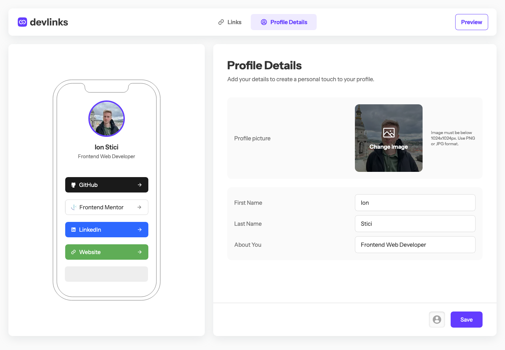

# devlinks // Link Sharing App

[**devlinks.fun**](https://www.devlinks.fun) is a web app developed as a solution to my first guru-level challenge on [Frontend Mentor](https://www.frontendmentor.io/challenges/linksharing-app-Fbt7yweGsT).

The app allows users to create personalized profiles where they can share their social links and professional information in the form of a profile card.

Users can easily manage their profile details, including adding a profile picture, updating their name and bio, and linking to up to 15 different platforms.

The project is currently live and accessible at [devlinks.fun](https://www.devlinks.fun), where users can experience the app's features and share their profile via a unique URL.



## Features

- **User Authentication:** Users can sign up with a new account and log in securely.

- **Profile Management:**

  - Users can log out, change their password, or delete their account.
  - The "Profile Details" section allows users to update their first name, last name, "About You" section, and profile picture.

- **Link Management:**

  - Users can manage up to 15 links, including popular platforms like GitHub, LinkedIn, Twitter, and more.
  - Links can be reordered via drag-and-drop, with validation on the server side.

- **Profile Access:** Profiles can be accessed via URLs in the format of `devlinks.fun/@username`, where users’ profiles are displayed as a card, complete with their picture, name, "About You" section, and social links.

- **Input Validation:** Both client-side and server-side validation are implemented to ensure data integrity

- **Feedback:** Utilizes the `useFormStatus` React hook and the `react-hot-toast` library to provide feedback during form submissions and server responses.

- **Comprehensive Error Handling:** All possible scenarios, such as invalid credentials and mismatched passwords, are managed to provide clear feedback to users.

- **Responsive Design:** The app is fully responsive, ensuring a seamless experience across all devices.

## Technologies Used

- **React and Next.js** for the frontend and server-side rendering.
- **Supabase** for user management and data storage.
- **Frame Motion** for drag-and-drop functionality.
- **React Hot Toast** for user feedback notifications.
- **Tailwind CSS** for styling.

## Project Structure

```plaintext
src/
|-- actions/            # Next.js Server Actions
|-- app/                # Next.js App Router
|   |-- segment/        # Page segment
|   |-- segment/_components/  # Page specific components
|-- hooks/              # Custom React Hooks
|-- ui/                 # Common React UI components
|-- data/               # Client data used by the app
|-- utils/
|   |-- supabase/       # Supabase configuration
```

## Deployment and Demo

- The app is deployed on Vercel
- Check out the live demo at devlinks.fun

## Author

- Website - [Add your name here](https://www.your-site.com)
- Frontend Mentor - [@yourusername](https://www.frontendmentor.io/profile/yourusername)
- Twitter - [@yourusername](https://www.twitter.com/yourusername)
